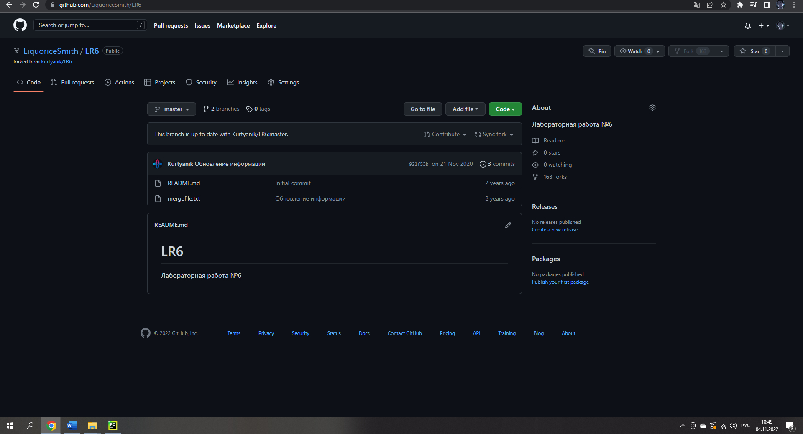

# LR6
Лабораторная работа №6
### Копия в личное хранилище

### Редактируем Git

###Клонирование личного репозитория на пк

###Добавление файла через интерфейс ГитХаб.

###Обновление локального репозитория

###Получаем историю операций каждой ветки

###Выполняем слияние, разрешая конфликт

###Удаляем побочную ветку

###Делаем изменения и фиксируем их

###Откат коммита

###Создание ветки для отчета

###История операций в форматированном виде

###Лог команд
    $ git clone
    $ git pull
    $ git branch -l
    $ git log
    $ git checkout branch1
    $ git merge branch1
    $ git add
    $ git status
    $ git commit
    $ git reset --hard HEAD~1
    $ git checkout -b New
    $ git log --pretty 